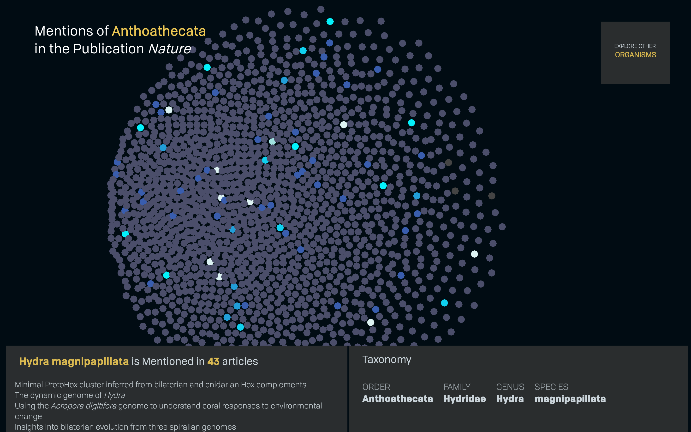

World species are declining at relatively high rates. Researchers in the fields of ecology, conservation biology, and related areas of study are working to better understand species, their habitats and the factors that are contributing to their loss. In generating this knowledge, the scientific community plays a large role in shaping conservation policy, natural resource management as well as our own understanding of nature. However, it has been shown that some species and taxa receive much more attention than others. As a result, species that may be more critical to the overall health of an ecosystem may also be those that are the least understood. With so much of our conservation practices dependent on the knowledge produced by the scientific community, it is critical to understand this taxonomic bias in research if we hope to address it.

This project offers one solution to the challenge of communicating bias in organismal research. Using publications from one major scientific journal, the visualization allows the reader to explore species that were most often the subject of a research paper. Exploring the articles in which these species were mentioned allows the reader to infer potential factors that lead to bias, such as accessibility of the environment or the utility of the organism to humans.  

This visual investigation aims to provoke the reader, prompting them to question our practices in understanding nature. Using research publications as a lens through which we can explore scientific methods of inquiry, this piece visualizes not only the species that receive the most human attention, but also those that may be least understood.

